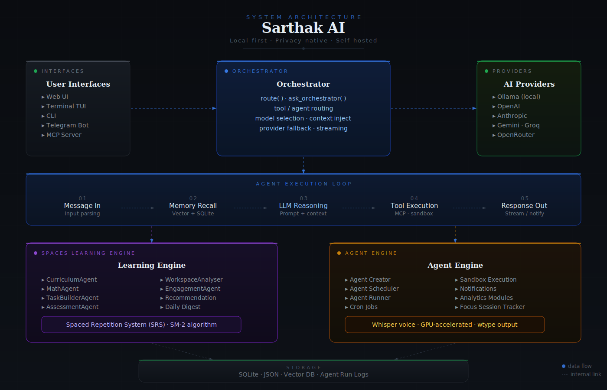

<div align="center">


# Sarthak AI

**Privacy-first AI learning companion and productivity intelligence platform.**  
Local. Offline-capable. Built around how experts actually work and learn.

[](LICENSE)
[](https://www.python.org/)
[](https://pypi.org/project/sarthak/)
[](https://productive-pro.github.io/sarthak)

[Get Started](#installation) · [Features](#features) · [Architecture](#architecture) · [Documentation](https://productive-pro.github.io/sarthak)

</div>

---

## Overview

Sarthak is a **local-first learning and productivity platform** that helps you master any skill the way an experienced practitioner would — with a personalized curriculum, spaced repetition, hands-on projects, and an AI mentor available every day.

It solves a real problem: most learning tools give you content, but not a *system*. Sarthak gives you:

- A **structured mastery engine** (Spaces) that builds a curriculum tailored to your background, selects the next concept at the edge of your ability (Zone of Proximal Development), and tracks your progress with XP, streaks, and spaced repetition.
- A **custom automation engine** (Agents) that lets you describe what you want in plain English — daily digests, weekly reviews, reminders — and runs it on a schedule.
- A **privacy-first architecture** where all data stays on your machine, API keys are encrypted at rest, and sensitive patterns are automatically scrubbed before any LLM sees them.

Everything runs fully offline with a local Ollama model, or with any cloud provider of your choice.

---

## Features

- **Adaptive learning Spaces** — generate a full AI curriculum for any domain (Data Science, AI Engineering, Medicine, Exam Prep, and more), personalized to your background and goal
- **Zone of Proximal Development** — the engine always selects the next concept at the edge of what you know; too-easy and too-hard concepts are deprioritized automatically
- **Spaced repetition (SM-2)** — concepts cycle back on an evidence-based review schedule; your SRS queue updates after every session
- **15 specialist AI sub-agents** — dedicated agents for curriculum planning, math explanations, task generation, project scaffolding, assessment, workspace analysis, and more
- **Custom automation agents** — describe an automation in plain English; Sarthak creates, schedules, and runs it on a cron schedule
- **4 built-in scheduled agents** — daily digest, SRS reminder, hourly recommendations, and weekly review — active from day one
- **Telegram delivery** — receive agent outputs and learning digests on your phone
- **RAG over your workspace** — Sarthak indexes your notes, PDFs, and code files and uses them as grounding context during sessions and explanations
- **Knowledge graph** — interactive D3 force-directed visualization of how your concepts connect
- **Speech-to-text notes** — dictate notes inside the concept workspace via whisper.cpp
- **Live code notebook & playground** — experiment directly inside a concept tab
- **Structured web UI** — React 19 SPA served locally; no cloud, no accounts
- **TUI dashboard** — Textual terminal UI for keyboard-driven workflows
- **MCP server** — expose Sarthak's capabilities to MCP-compatible tools (Claude Code, Gemini CLI, opencode)
- **Multi-provider AI** — Ollama, OpenAI, Anthropic, Gemini, Groq, GitHub Models, OpenRouter, or any OpenAI-compatible endpoint, with a 3-tier fallback chain
- **Privacy-first by design** — all data is local, encryption is AES-GCM at rest, secrets are scrubbed before every LLM call
- **Cross-platform** — Linux, macOS, Windows; installable as a background service

---

## Architecture

Sarthak is built around two independent subsystems — the **Spaces mastery engine** and the **custom agent engine** — unified by a single orchestrator and AI provider abstraction layer.



### Orchestrator Agent

A single `pydantic-ai` orchestrator handles all free-text input from every channel (TUI, Telegram, Web). It delegates to specialist tools and sub-agents registered via `@agent.tool`. No channel does its own routing — everything flows through one entry point.

### Spaces Engine

Fifteen stateless specialist sub-agents, each with one responsibility. They are composed by `SpacesOrchestrator` to drive a full learning session: detect learner background → select next concept (ZPD) → explain with math if needed → generate a hands-on task → scaffold a project → assess the submission → update SRS schedule → write `Optimal_Learn.md`.

### Agent Engine

Users define agents in plain English. `creator.py` parses the description via LLM into an `AgentSpec` (cron schedule + tool list + sandbox policy). `scheduler.py` fires due agents every 60 seconds as async tasks. Every run is wrapped by `enforce_sandbox()`, which enforces timeouts, memory caps, path guards, secret scrubbing, and output truncation.

### LLM Provider Abstraction

`build_fallback_model()` builds a 3-tier `FallbackModel` chain from `config.toml`. If the primary model fails, Sarthak automatically retries with fallback1, then fallback2 — agents never crash on transient provider errors.

---

## Tech Stack

| Layer | Technology |
|:---|:---|
| **Language** | Python 3.11+ |
| **AI agents** | pydantic-ai |
| **Web backend** | FastAPI, uvicorn |
| **Frontend** | React 19, Vite 7, Zustand 5 |
| **TUI** | Textual |
| **Database** | SQLite (aiosqlite), sqlite-vec (RAG) |
| **CLI** | Click |
| **Logging** | structlog |
| **Scheduling** | croniter, asyncio |
| **Encryption** | AES-GCM (cryptography) |
| **Speech-to-text** | whisper.cpp (whisper-cli) |
| **Notifications** | python-telegram-bot, dunst |
| **MCP** | mcp (stdio transport) |

---

**Key data locations at runtime:**

| Path | Contents |
|:---|:---|
| `~/.sarthak_ai/sarthak.db` | Activity events (SQLite) |
| `~/.sarthak_ai/agents/` | Global agent specs and run history |
| `~/.sarthak_ai/spaces.json` | Global spaces registry |
| `<space_dir>/.spaces/sarthak.db` | AI curriculum — chapters, topics, concepts |
| `<space_dir>/.spaces/roadmap.json` | Session history, XP, streak |
| `<space_dir>/.spaces/Optimal_Learn.md` | Workspace analysis written after each session |
| `<space_dir>/.spaces/chroma.db/` | RAG vector index |

---

## Installation

### Requirements

- Python 3.11 or higher
- An AI provider: [Ollama](https://ollama.com) (local, free) **or** a cloud provider API key
- ActivityWatch (optional, for focus tracking)

### One-line install — Linux / macOS

```bash
curl -fsSL https://raw.githubusercontent.com/productive-pro/sarthak/main/scripts/install.sh | bash
```

### One-line install — Windows (PowerShell)

```powershell
irm https://raw.githubusercontent.com/productive-pro/sarthak/main/scripts/install.ps1 | iex
```

The installer sets up Sarthak, registers it as a background service (systemd / launchd / Task Scheduler), and generates your local encryption key.

### Install from PyPI

```bash
# Minimal install (Ollama or GitHub Models)
pip install sarthak

# With cloud provider support (OpenAI, Anthropic)
pip install "sarthak[cloud]"

# Recommended: use uv
uv tool install sarthak
```

### Install from source

```bash
git clone https://github.com/productive-pro/sarthak
cd sarthak
uv sync
uv run sarthak --help
```

---

## Usage

### First-time setup

```bash
sarthak configure
```

The interactive wizard walks you through selecting an AI provider, entering your API key (encrypted at rest), and setting basic preferences. Use `--mode quick` for a minimal setup.

### Start Sarthak

```bash
# Start everything: web UI + agent scheduler + background services
sarthak service install
```

Then open **[http://localhost:4848](http://localhost:4848)** in your browser.

### Check status

```bash
sarthak status
```

### Creating a Learning Space

1. Open **Spaces** in the sidebar → click **+ New Space**
2. Set your workspace folder, domain, background, and learning goal
3. Sarthak generates a full curriculum roadmap and organizes your workspace

**Supported domains:** Data Science · AI Engineering · Software Engineering · Medicine · Education · Exam Prep · Research · Custom

### Creating an automation agent

```bash
# From the web UI: Agents → + New Agent
# Describe in plain English, for example:
"Every morning at 8am, send me a digest of what I should study today"
"Every Sunday, review my weakest concepts and send a study plan to Telegram"
```

Sarthak infers the schedule, selects the right tools, and saves the agent. Results can be delivered to Telegram.

### CLI commands

```bash
sarthak service install       # Start all services
sarthak tui                   # Open terminal UI
sarthak configure             # Run setup wizard
sarthak status                # Check service and provider health
sarthak encrypt "my-api-key"  # Encrypt a secret for config.toml
sarthak spaces list           # List all Spaces
sarthak spaces roadmap        # Regenerate roadmap for active Space
sarthak spaces optimize       # Run signal optimizer for active Space
```

---

## Configuration

All configuration lives in `config.toml` at the project root or `~/.sarthak_ai/config.toml`. The **Config** page in the web UI is a live editor that validates and saves changes instantly.

### AI provider

```toml
[ai]
default_provider = "ollama"    # ollama | openai | anthropic | gemini | groq | openrouter
default_model    = "gemma3:4b"

[ai.ollama]
base_url   = "http://localhost:11434/v1"
text_model = "gemma3:4b"

[ai.openai]
model = "gpt-4o-mini"

[ai.anthropic]
model = "claude-3-5-haiku-20241022"

[ai.fallback]
fallback1_provider = "ollama"
fallback1_model    = "gemma3:4b"
fallback2_provider = ""
fallback2_model    = ""
```

**Supported providers:** Ollama · OpenAI · Anthropic · Google Gemini · Groq · OpenRouter · GitHub Copilot · HuggingFace · Grok · Custom OpenAI-compatible endpoints

### Web server

```toml
[web]
host = "127.0.0.1"
port = 4848
```

### Telegram notifications

```toml
[telegram]
enabled         = true
bot_token       = "ENC:..."       # encrypt with: sarthak encrypt <token>
allowed_user_id = 123456789
```

### Sandbox (agent resource limits)

```toml
[agents.sandbox.system]
enabled       = true    # set false in dev to disable sandboxing
wall_timeout  = 120     # seconds per agent run
output_cap    = 65536   # bytes
max_web_calls = 10
```

### Speech-to-text

```toml
[whisper]
model     = "base.en"   # tiny | base | small | medium | large
device    = "CPU"       # CPU | GPU | NPU
language  = "auto"
```

### Encrypting secrets

Never store API keys in plain text. Encrypt them first:

```bash
sarthak encrypt "sk-..."
# → ENC:abc123...
```

Paste the `ENC:...` value into `config.toml` or the Config page.

---

## Development

### Prerequisites

```bash
# Install uv (recommended package manager)
curl -LsSf https://astral.sh/uv/install.sh | sh

# Clone and install dependencies
git clone https://github.com/productive-pro/sarthak
cd sarthak
uv sync
```

### Running tests

```bash
uv run pytest                    # full suite
uv run pytest tests/agents/      # agent engine tests only
```

### Linting and formatting

```bash
uv run ruff check src/
uv run ruff format src/
```

### Frontend development

```bash
cd frontend
npm install
npm run dev        # dev server at localhost:5173 (proxies /api → localhost:4848)
npm run build      # production build → dist/
npm run lint

# From repo root — build and copy to FastAPI serving dir:
bash rebuild_frontend.sh
```

> Run `bash rebuild_frontend.sh` any time you change frontend code before restarting the server.

### Building a standalone binary

```bash
bash scripts/build_binary.sh    # Linux / macOS → dist/sarthak
.\scripts\build_binary.ps1      # Windows → dist/sarthak.exe
```

### Syncing the provider model catalog

```bash
OPENROUTER_API_KEY=... OPENAI_API_KEY=... uv run scripts/sync_catalog.py
```

This fetches live model lists from OpenRouter, OpenAI, Ollama, and GitHub Copilot and merges them into `providers.json` (never deletes existing entries).

### Adding a new orchestrator tool

1. Implement the tool function in `features/ai/tools/`
2. Import and register it in `features/ai/agents/orchestrator.py` with `@agent.tool`
3. Add a clear docstring — pydantic-ai exposes it to the LLM as the tool description

### Adding a new built-in scheduled agent

1. Add an entry to `_BUILTIN_AGENTS` in `agents/scheduler.py`
2. Add a handler `_run_<name>_agent(spec)` and register it in `_run_agent_with_context()`
3. Delegate to existing helpers (`build_digest`, `get_due`, etc.) — keep handlers focused

### Key conventions

- **No regex routing** — all free-text goes to the orchestrator agent
- **JSON from LLM** — prompt must end with `Output ONLY valid JSON: {...}`; parse with `parse_json_response(raw)`; always provide a fallback dict
- **Pydantic v2** — use `model.model_dump_json()`, `Model.model_validate_json()`. Do not use v1 `.dict()` / `.parse_raw()`
- **Async throughout** — all I/O is `async`; use `asyncio.create_task()` for fire-and-forget runs
- **Structured logging** — `structlog.get_logger(__name__)`, log with key-value pairs
- **Secret scrubbing** — `enforce_sandbox()` runs automatically; never pass API keys in agent prompts

---

## Roadmap / Future Improvements

- **Voice-first interface** — full voice conversation mode for hands-free learning sessions
- **Collaborative Spaces** — shared workspaces for teams and study groups
- **Plugin system** — allow community-built specialist sub-agents and tools
- **Offline-first sync** — conflict-free replicated data for multi-device use without a server
- **Exam-mode assessments** — timed full-length mock exams with automated rubric grading
- **ActivityWatch deep integration** — richer activity signals for curriculum adaptation
- **More domain templates** — Law, Finance, Language Learning, Music

---

## Contributing

Contributions are welcome. Please read [`CONTRIBUTING.md`](CONTRIBUTING.md) before opening a pull request.

```bash
# Fork, clone, and set up your environment
git clone https://github.com/<your-username>/sarthak
cd sarthak
uv sync

# Create a feature branch
git checkout -b feat/my-feature

# Make your changes, then run checks
uv run pytest
uv run ruff check src/
uv run ruff format src/

# Submit a pull request
```

**Before contributing code**, read [`AGENTS.md`](AGENTS.md) — it is the authoritative guide to the codebase architecture, conventions, and how to add new capabilities correctly.

For bugs and feature requests, open an issue at [github.com/productive-pro/sarthak/issues](https://github.com/productive-pro/sarthak/issues).

---

## License

Sarthak is released under the [GNU Affero General Public License v3.0](LICENSE) (AGPL-3.0).

If you want to use Sarthak in a proprietary product or service without AGPL obligations, [contact us for a commercial license](mailto:hello@sarthak.ai).

---

<div align="center">

Built with the belief that every person deserves a senior mentor — available every day.

</div>
